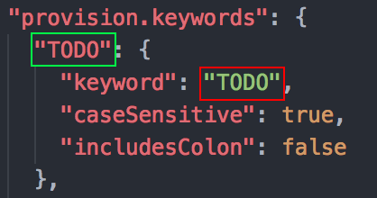

<h1 align="center">
  <p align="center">
    
  </p>
  <br>
  <p>Provision: Lens - Manual</p>
  <p style="color: #A2A2A2; font-size: 18px;">The best way to keep your notes organized</p>
</h1>
<br/>

<!-- # Table of content
* [Setting up Keywords and Groups](#setting-up-keywords-and-groups) -->

<!-- <br/> -->

## Setting up Keywords and Groups
You can create a new keyword by following these steps and pasting them inside your `settings.json`.

###  Step 1
Add a new object inside your `provision.keywords` object. The following properties can be set:

```json
  "TODO": {
    "keyword": "TODO",
    "caseSensitive": true,
    "includesColon": true
  }
```

#### What do the properties do
* `keyword`: The exact keyword which needs to be found inside your files.
* `caseSensitive`: If the keyword needs to be case sensitive or not.
* `includesColon`: If the keyword can only be valid with a colon sign afterwards.

### Step 2
> If you are planning to add the keyword to a group you can skip this step.

Add the `title` property to your newly created keyword.

If you have done this the keyword is correctly added to your setttings.

```json
  "TODO": {
    "keyword": "TODO",
    "caseSensitive": true,
    "includesColon": true,
    "title": {
      "1": "{0} TODO",
      "*": "{0} TODO's"
    },
    "tooltip": "All the todo's and fixme's found in this file"
  }
```

#### What do the properties do
* `title`: An object with the different titles used. `*` is the default text and every other number (the amount of notes found) will be chosen if there is a title.
* `tooltip`: The text shown when hovering over.

### Step 3
> If you did step 2, ignore this step

Add your newly created keyword to an existing group (or create a new one).
This is done by adding the following object to your `provision.groups` setting.

```json
  {
    "keywords": ["TODO", "FIXME"],
    "title": {
      "1": "{0} TODO",
      "*": "{0} TODO's"
    },
    "tooltip": "All the todo's and fixme's found in this file"
  }
```

**Note:** the keyword that you add to the keywords array needs to be the same
as the `keyword object` *(highlighted green)* inside your `provision.keywords` and NOT the keyword objects keyword property *(highlighted red)*.

<p align="center">
  
</p>


#### What do the properties do
* `title`: An object with the different titles used. `*` is the default text and every other number (the amount of notes found) will be chosen if there is a title.
* `tooltip`: The text shown when hovering over.