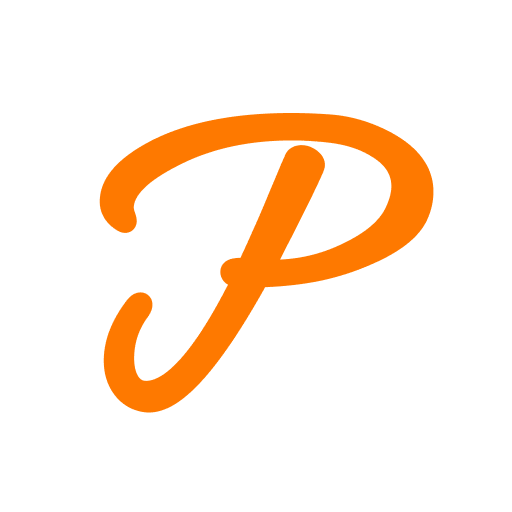

<h1 align="center">
  <p align="center">
    
  </p>
  <p>ProVision</p>
  <p style="color: #A2A2A2; font-size: 18px;">The best way to keep your notes organized</p>
  <br>
  <p style="color: #3366BB; font-size: 14px; font-weight: normal;">
    <a href="https://marketplace.visualstudio.com/items?itemName=fooxly.provision">ProVision Bundle</a>&nbsp;&nbsp;&nbsp;
    <a href="https://marketplace.visualstudio.com/items?itemName=fooxly.provision-lens">ProVision: Lens</a>&nbsp;&nbsp;&nbsp;
    <a href="https://marketplace.visualstudio.com/items?itemName=fooxly.provision-bar">ProVision: Bar</a>&nbsp;&nbsp;&nbsp;
    <a href="https://marketplace.visualstudio.com/items?itemName=fooxly.provision-syntax">ProVision: Syntax</a>
  </p>
</h1>
<br/>

# The ProVision Manual

Welcome to the ProVision manual, hopefully we can help you find what you need. This manual contains information for all 3 ProVision packages. If you can't find the information you need or feel like something is wrong, please create an issue on one of our Github projects.

## Table of contents

1. [Introduction](#introduction)
2. [Setup](#📙-setup)
    1. [Keywords property](#keywords-property)
    2. [Groups property](#groups-property)
3. [General settings](#⚙️-general-settings)
4. [Commands](#📕-commands)
5. [Extensions](#📦-extensions)
    1. [ProVision: Bar](#provision-bar)
    2. [ProVision: Syntax](#provision-syntax)
    3. [ProVision: Lens](#provision-lens)
6. [Useful information](#useful-information)
    1. [Default settings](#default-settings)
    2. [overviewRulerLane](#overviewrulerlane)

## Introduction

ProVision is a collection of VSCode extesions which provide a better overview for you. All of our extensions will be **highly customizable** and sve you a lot of time searching, unfolding or navigating towards notes.

## 📙 Setup

### Keywords property

Setting up keywords is quite simple, inside your settings you should have/create the `ProVision.keywords` object which will hold all of your keywords.

Here is an example of a keyword:

```json
"ProVision.keywords": {
    ...,
    "TODO": {
        "group": "notes",
        // Styling only needed for ProVision: Syntax
        "color": "#fff",
        "backgroundColor": "#f2b01f",
        "overviewRulerColor": "rgba(242, 176, 31, 0.8)",
        "overviewRulerLane": 4,
    },
}
```

Now let us explain the properties to you. All of the properties are **optional**.

**Note**: Styling is done using [DecorationRenderOptions](https://code.visualstudio.com/api/references/vscode-api#DecorationRenderOptions). Every property from that can be used inside the keyword options.

- `group`: In which group the keyword should be placed.

### Groups property

The groups property allows you to customize a group which you specified inside a keyword.
To start customizing the appearance of your groups, create the `ProVision.groups` object.

**It's important to remember that the group names are case sensitive.**<br/>
Here is an example of a group:

```json
"ProVision.groups": {
    ...,
    "todos": {
        "title": "$(info) {0}",
        "tooltip": "All my notes",
        "foregroundStyle": "statusBarItem.warningForeground",
        "backgroundStyle": "statusBarItem.warningBackground"
    },
}

OR

"ProVision.groups": {
    ...,
    "todos": {
        "title": {
            "1": "1 Note",
            "*": "{0} Notes"
        },
        "tooltip": "All my notes",
        "foregroundStyle": "#FFFFFF",
        "backgroundStyle": "statusBarItem.warningBackground"
    },
}
```

*Note: $(info) and many other icons from the vscode icon theme can be used.*

Now let us explain the properties to you. All of the properties are **optional**.

**General properties:**

- `title`: This can be a string or object to specify the title which will be shown to you.
- `tooltip`: Shown when hovering over the statusbar and code lens item.

**ProVision: Bar specific properties:**

- `foregroundStyle`: Adds a foreground color to the statusbar item.<br/>
**Note:** Hex codes or [Theme Color](https://code.visualstudio.com/api/references/theme-color) possible.
- `backgroundStyle`: Adds a background color to the statusbar item.<br/>
**Note:** only [Theme Color](https://code.visualstudio.com/api/references/theme-color) possible.

## ⚙️ General settings

- `ProVision.list.moveOnSingleResult`: Jump to the note instantly when there are is only 1 result.

    ```json
    "ProVision.list.moveOnSingleResult": <true|false>
    ```

## 📕 Commands

- `Help: ProVision`: Shows you the manual you are currently reading.
- `ProVision: List All`: Shows you all the notes in the current file.
- `ProVision: List Group`: Shows you all the notes in the current file from a specifc group.
<br/>

## 📦 Extensions

### ProVision: Bar

[**ProVision: Bar**](https://marketplace.visualstudio.com/items?itemName=fooxly.provision-bar) provides **easy to use** and **highly customizable** buttons to your statusbar. When opening a file it will search for the provided keywords and show you a simple overview of your notes. When clicking on a group you get an overview of all your notes in the specified group.

#### Groups

Every keyword which has the **group** property will be searched for and added to the statusbar. If you would like to add custom styling for the group you can use the [ProVision.groups](#groups-property) property which is explained above.

#### Settings

- `ProVision.bar.side`: On which side of the statusbar the items should appear.

    ```json
    "ProVision.bar.side": <"left"|"right">
    ```

- `ProVision.bar.priority`: The priority the items get inside the statusbar.

    ```json
    "ProVision.bar.priority": <number>
    ```

### ProVision: Syntax

[**ProVision: Syntax**](https://marketplace.visualstudio.com/items?itemName=fooxly.provision-syntax) applies **easy to use** and **highly customizable** syntaxing to your editor. With this extension you can quickly recognize your notes and seperate them from your actual code. Our theming supports everything from **color and background** to **borders and font changes**!

### ProVision: Lens

[**ProVision: Lens**](https://marketplace.visualstudio.com/items?itemName=fooxly.provision-lens) provides **easy to use** Code Lenses. When opening a file it will search for the provided keywords and show you a simple overview of your notes. When clicking on a group you get an overview of all your notes in the specified group.

#### Groups

Every keyword which has the **group** property will be searched for and added to the statusbar. If you would like to add custom styling for the group you can use the [ProVision.groups](#groups-property) property which is explained above.

## Useful information

### Default settings

We provide some settings by default to get you started right away. If you ever want to tweak the default settings a small bit, you can copy the settings here and tweak them to your liking.

```json
"ProVision.keywords": {
    "TODO": {
        "group": "notes",
        "color": "#fff",
        "backgroundColor": "#f2b01f",
        "overviewRulerColor": "rgba(242, 176, 31, 0.8)",
        "overviewRulerLane": 4
    },
    "FIXME": {
        "group": "notes",
        "color": "#fff",
        "backgroundColor": "#d85f88",
        "overviewRulerColor": "rgba(216, 95, 136, 0.8)",
        "overviewRulerLane": 4
    },
    "NOTE": {
        "group": "notes",
        "color": "#aaa",
        "backgroundColor": "#434343",
        "overviewRulerColor": "rgba(67, 67, 67, 0.8)",
        "overviewRulerLane": 4
    }
}
```

### overviewRulerLane

Overview ruler lanes support the following values. These values are used for ProVision: Syntax in the keyword property.

| Lane | Value |
| --- | --- |
| Left | 1 |
| Center | 2 |
| Right | 4 |
| Full | 7 |
